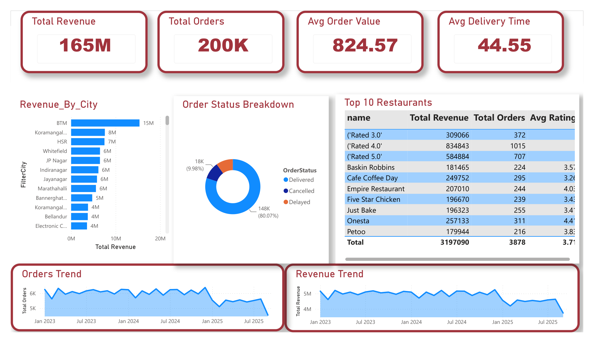
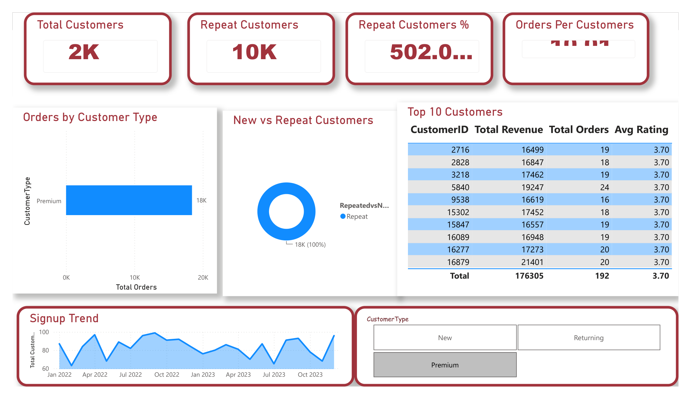
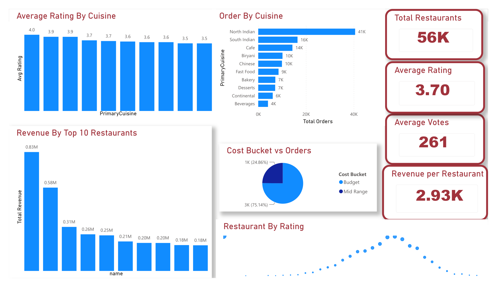
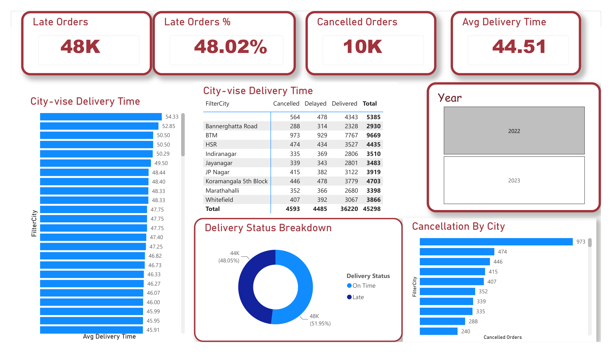
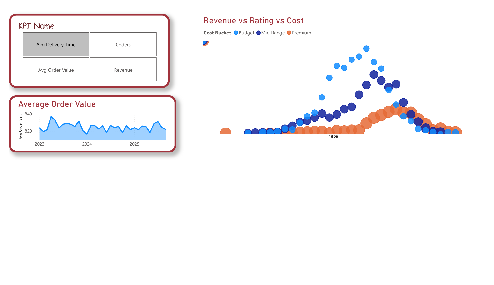
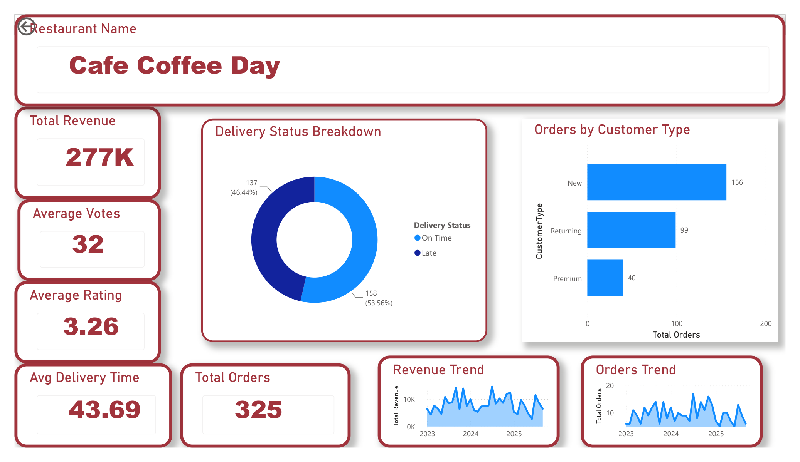

# Restaurant Analytics Dashboard

Interactive Power BI dashboard to analyze restaurant performance metrics including sales, ratings, and trends.

## Dashboard Preview

**Overview — revenue, orders, order status and trends**

**Customer Analytics — repeat behaviour, top customers, signup trend**

**Restaurant & Cuisine Analysis — ratings, orders and revenue by cuisine**

**Delivery Performance — late orders, cancellations, city-wise delivery times**

**KPI Explorer — switch the trend chart between KPIs with field parameters**

**Restaurant Drill-Through — per-restaurant detail page**

## Features

- **Sales Analysis** — Track revenue across locations, categories, and time periods
- **Rating Insights** — Visualize customer ratings and satisfaction trends
- **Dynamic Visualizations** — Bar charts, slicers, KPI cards, and maps with drill-down capability
- **Customer Patterns** — Identify peak hours, top-selling items, and ordering trends
- **Data Cleaning** — Power Query transformations handling missing values and inconsistent formats

## Tech Stack

- **Power BI** — Dashboard design and interactive visualizations
- **SQL** — Data querying and analysis
- **Power Query** — Data cleaning and transformation

## How to Use

1. Download `Restaurant_Analytics_Dashboard.pbix`
2. Open with [Power BI Desktop](https://powerbi.microsoft.com/desktop/)
3. Explore the interactive dashboard

## Author

**Vivek Parashar** — [LinkedIn](https://www.linkedin.com/in/vivek-parashar-845725281) | [GitHub](https://github.com/vivekparashar999)
